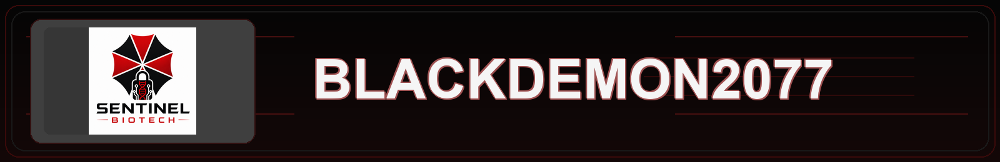
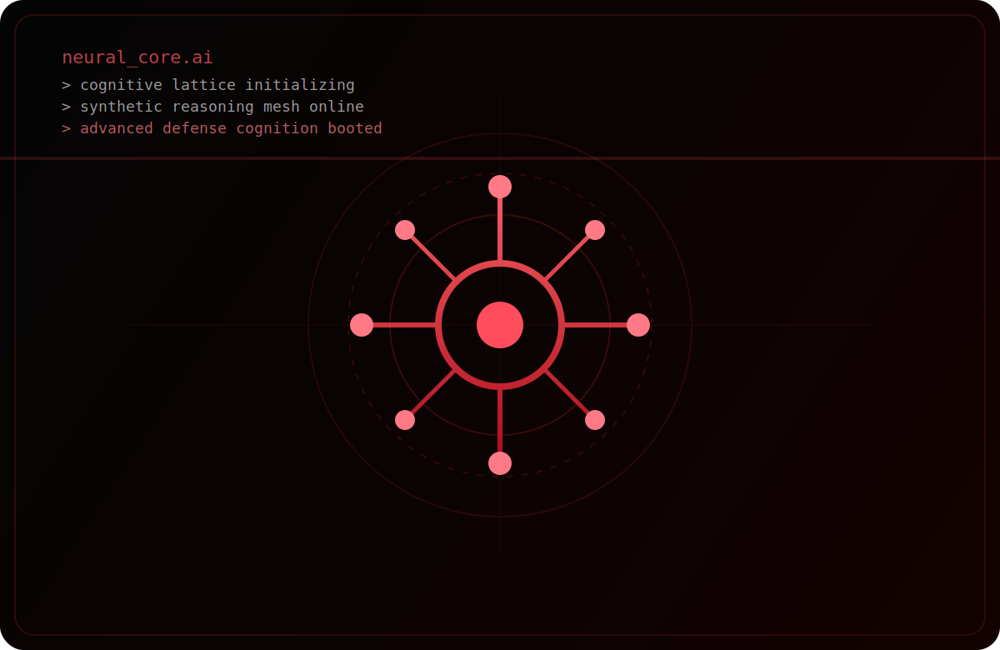

<div align="center">
   
</div>

<div align="center">
  
</div>

<table>
  <tr>
    <td width="50%" align="center" valign="middle">
      
    </td>
    <td width="50%" align="center" valign="middle">
      
    </td>
  </tr>
</table>

## Identity // About Me

Sou **Gustavo - BlackDaemon2077**, estudante de Engenharia da Computação, apaixonado por Inteligência Artificial, Engenharia de Dados, Automação, Cibersegurança e Sistemas Inteligentes. Meu foco é desenvolver soluções inovadoras que integrem dados, software e IA para transformar processos complexos em decisões mais rápidas, precisas e eficientes. Estou sempre explorando novas tecnologias, arquiteturas escaláveis e aplicações avançadas de machine learning para criar projetos com impacto real.

I am **Gustavo - BlackDaemon2077**, a Computer Engineering student passionate about Artificial Intelligence, Data Engineering, Automation, Cybersecurity, and Intelligent Systems.
My focus is on developing innovative solutions that integrate data, software, and AI to transform complex processes into faster, more accurate, and more efficient decision-making.
I am constantly exploring emerging technologies, scalable architectures, and advanced machine learning applications to build projects that create real-world impact and drive digital transformation.


```text
> boot sector online
> neural interface stabilized
> automation cores loaded
> profile visibility set to public
```

## Certifications // Verified Modules

<div align="center">
  
</div>

<p align="center">
  
  
  
</p>

## Tech Stack // Arsenal

<p align="center">
  
  
  
  
  
  
  
  
  
  
  
  
  
  
  
</p>

## SYSTEM ACCESS // MINI GAME

```text
ACCESS NODE : SENTINEL-07
STATUS      : BREACHING...
MISSION     : Decode the neural key.
KEY         : N3UR0M4NC3R
RESULT      : SYSTEM PARTIALLY UNLOCKED
```
<p align="center">
  
</p>


<div align="center">
  
</div>


| Mission | Status |
| --- | --- |
| Learn Python Core | Completed |
| Build ChatBot Systems | Completed |
| Big Data Analytics | Completed |
| Threat Hunting Lab | In Progress |
| AI Automation Stack | In Progress |

## Rainha Vermelha // Neural Core Metrics

Construindo uma inteligencia artificial experimental inspirada na Rainha Vermelha: automacao, analise de dados, seguranca e sistemas cognitivos.

<p align="center">
  
</p>

```text
> red_queen.dev :: neural core assembly
> sector :: experimental cognition chamber
> interface :: crimson terminal / live diagnostics
```

<table>
  <tr>
    <td><b>Neural Core Progress</b><br><code>87%</code></td>
    <td><b>AI Consciousness Level</b><br><code>12.4%</code></td>
    <td><b>Data Ingestion</b><br><code>Operational</code></td>
  </tr>
  <tr>
    <td><b>Security Protocols</b><br><code>Online</code></td>
    <td><b>Automation Modules</b><br><code>Active</code></td>
    <td><b>Threat Analysis Layer</b><br><code>Monitoring</code></td>
  </tr>
  <tr>
    <td><b>BioTech Simulation</b><br><code>Stable</code></td>
    <td><b>System Stability</b><br><code>94%</code></td>
    <td><b>Red Queen Boot Sequence</b><br><code>Phase 02</code></td>
  </tr>
</table>

<p align="center">
  
  
  
</p>

<p align="center">
  
  
  
</p>

<p align="center">
  
  
  
</p>

## Signal // Current Focus

- Building practical automation with Python and data workflows
- Exploring AI systems, LLM integrations and chatbot experiences
- Strengthening cybersecurity and threat-hunting fundamentals
- Turning raw information into useful, operational intelligence
