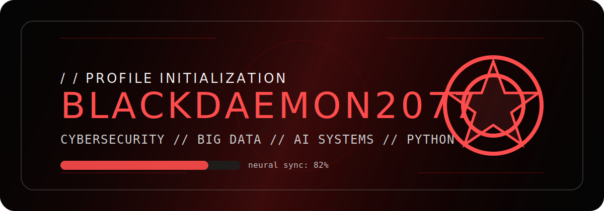
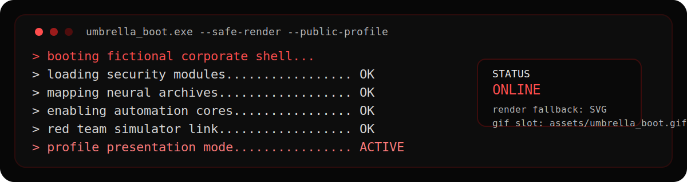
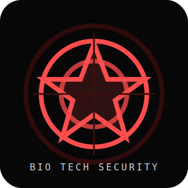
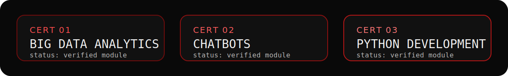

<div align="center">
  
</div>

<div align="center">
  
</div>

<!-- Future drop-in replacement:

-->

<p align="center">
  
</p>

<p align="center">
  <code>Cybersecurity • Big Data • AI Systems • Python Development • ChatBots</code>
</p>

## Identity // About Me

Sou **BlackDaemon2077**, estudante de Engenharia da Computacao e entusiasta de IA, automacao, seguranca, Big Data e sistemas inteligentes. Gosto de construir solucoes praticas que unem dados, automacao e inteligencia artificial.

```text
> boot sector online
> neural interface stabilized
> automation cores loaded
> profile visibility set to public
```

## Certifications // Verified Modules

<div align="center">
  
</div>

<p align="center">
  
  
  
</p>

## Tech Stack // Arsenal

<p align="center">
  
  
  
  
  
  
  
  
  
  
  
  
  
  
  
</p>

## SYSTEM ACCESS // MINI GAME

```text
ACCESS NODE : [■■■□□□□□]
STATUS      : BREACHING...
MISSION     : Decode the neural key.
KEY         : N3UR0M4NC3R
RESULT      : SYSTEM PARTIALLY UNLOCKED
```

| Mission | Status |
| --- | --- |
| Learn Python Core | Completed |
| Build ChatBot Systems | Completed |
| Big Data Analytics | Completed |
| Threat Hunting Lab | In Progress |
| AI Automation Stack | In Progress |

## RED QUEEN PROJECT // SYSTEM METRICS

Experimental AI core inspired by bio-digital intelligence, automation, cybersecurity and data analysis.

```text
> red_queen.core :: awakening laboratory monitor
> environment :: secret biolab sector
> display mode :: crimson terminal dashboard
```

<table>
  <tr>
    <td><b>AI Core Stability</b><br><code>87%</code></td>
    <td><b>Neural Training Cycles</b><br><code>2077</code></td>
    <td><b>Bio-Digital Protocols</b><br><code>Active</code></td>
    <td><b>Threat Detection Layer</b><br><code>Online</code></td>
  </tr>
  <tr>
    <td><b>Python Development Level</b><br><code>Advanced</code></td>
    <td><b>Big Data Analysis Matrix</b><br><code>Operational</code></td>
    <td><b>ChatBot Cognition Engine</b><br><code>Learning</code></td>
    <td><b>Red Queen Awakening</b><br><code>2.2%</code></td>
  </tr>
</table>

<p align="center">
  
  
  
  
</p>

<p align="center">
  
  
  
  
</p>

## Signal // Current Focus

- Building practical automation with Python and data workflows
- Exploring AI systems, LLM integrations and chatbot experiences
- Strengthening cybersecurity and threat-hunting fundamentals
- Turning raw information into useful, operational intelligence
